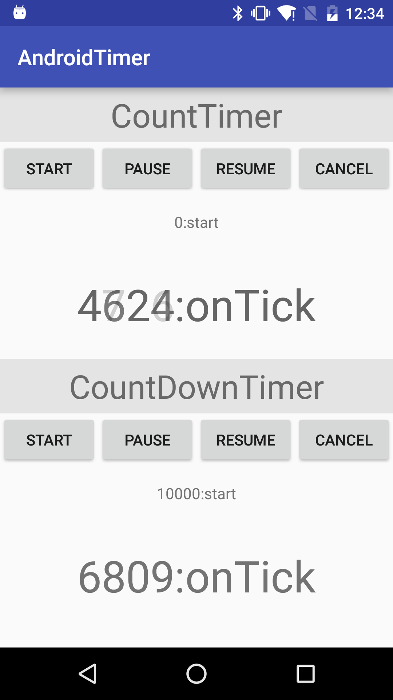

#android-timer

基于Handler的Android定时器与倒计时器

修改自 [CountDownTimer](http://developer.android.com/reference/android/os/CountDownTimer.html)

##特性

支持操作 :

1. start
1. pause
1. resume
1. cancel

##使用

###CountTimer

    new CountTimer(100) {

        @Override
        public void onTick(long millisFly) { // millisFly is the Elapsed time at *Running State*
            vCountSwitcher.setText((millisFly) + "");
            Log.d("onTick", millisFly + "");
        }
    };

###CountDownTimer

    new CountDownTimer(100) {

        @Override
        public void onTick(long millisUntilFinished) { // millisUntilFinished is the left time at *Running State*
            Log.d("onTick", millisFly + "");
        }

        @Override
        public void onCancel(long millisUntilFinished) {
        }

        @Override
        public void onPause(long millisUntilFinished) {
        }

        @Override
        public void onResume(long millisUntilFinished) {
        }

        @Override
        public void onFinish() {
        }
    };

##截图

