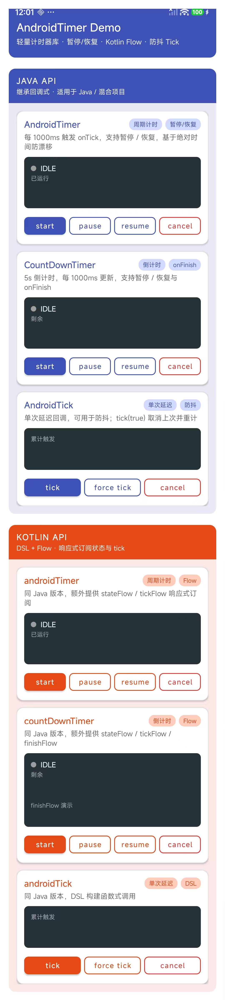

# AndroidTimer

一个轻量级的Android计时器库，提供AndroidTimer和CountDownTimer两个核心组件，支持灵活的状态管理。



## 🚀 快速开始

### 1. 添加依赖

在模块目录的 `build.gradle` 文件中添加：

#### Java 项目

```gradle
dependencies {
    implementation 'io.github.xesam:android-timer:0.4.0'
}
```

#### Kotlin 项目（含 Flow API）

```gradle
dependencies {
    implementation 'io.github.xesam:android-timer-kt:0.4.0'
}
```

> `android-timer-kt` 已通过 `api` 依赖传递 `android-timer`，无需重复声明。

### 2. 基本使用

#### AndroidTimer（周期性计时器）

```java
// 创建计时器：每1000ms触发一次onTick
AndroidTimer timer = new AndroidTimer(1000L) {
            @Override
            protected void onTick(long millisFly) {
                Log.d("Timer", "Elapsed: " + millisFly + "ms");
            }

            @Override
            protected void onStart(long millisFly) {
                Log.d("Timer", "Started at: " + millisFly + "ms");
            }

            @Override
            protected void onPause(long millisFly) {
                Log.d("Timer", "Paused at: " + millisFly + "ms");
            }

            @Override
            protected void onResume(long millisFly) {
                Log.d("Timer", "Resumed from: " + millisFly + "ms");
            }

            @Override
            protected void onCancel(long millisFly) {
                Log.d("Timer", "Cancelled at: " + millisFly + "ms");
            }
        };

// 启动
timer.start();

// 暂停
timer.pause();

// 恢复
timer.resume();

// 取消
timer.cancel();
```

#### CountDownTimer（倒计时器）

```java
// 创建倒计时器：10秒倒计时，每100ms更新一次
CountDownTimer countDownTimer = new CountDownTimer(10000L, 100L) {
            @Override
            protected void onStart(long millisUntilFinished) {
                // 倒计时开始
                Log.d("CountDown", "Started: " + millisUntilFinished + "ms remaining");
            }

            @Override
            protected void onTick(long millisUntilFinished) {
                // 倒计时进行中
                Log.d("CountDown", "Remaining: " + millisUntilFinished + "ms");
            }

            @Override
            protected void onPause(long millisUntilFinished) {
                // 倒计时暂停
                Log.d("CountDown", "Paused with " + millisUntilFinished + "ms remaining");
            }

            @Override
            protected void onResume(long millisUntilFinished) {
                // 倒计时恢复
                Log.d("CountDown", "Resumed with " + millisUntilFinished + "ms remaining");
            }

            @Override
            protected void onCancel(long millisUntilFinished) {
                // 倒计时取消
                Log.d("CountDown", "Cancelled with " + millisUntilFinished + "ms remaining");
            }

            @Override
            protected void onFinish(long millisDuration) {
                // 倒计时完成
                Log.d("CountDown", "Finished!");
            }
        };
// 启动
countDownTimer.start();

// 暂停
countDownTimer.pause();

// 恢复
countDownTimer.resume();

// 取消
countDownTimer.cancel();
```

#### AndroidTick（单次延迟回调）

一个轻量级的单次延迟工具。`tick()` 触发一次延迟任务，回调触发后自动结束。

```java
// 创建：500ms 后触发一次回调
AndroidTick tick = new AndroidTick(500L) {
    @Override
    protected void onTick(AndroidTick instance, int count) {
        // count 为累计触发次数
        Log.d("Tick", "Triggered " + count + " times");
    }
};

// 触发延迟任务（若已有待执行任务，此次调用被静默忽略）
tick.tick();

// 取消上一次任务并重新计时
tick.tick(true);

// 取消待执行的回调
tick.cancel();
```

> 构造参数 `millisDelay` 必须大于 0，否则抛出 `IllegalArgumentException`。可通过 `isRunning()` 查询是否有待执行任务。

**典型场景**：搜索框防抖（用户停止输入后 500ms 才发起请求）、延迟隐藏 Toast。

## 📋 API 文档

### AndroidTimer

#### 构造函数

```java
AndroidTimer(long interval)

AndroidTimer(long interval, AndroidTimer.Option option)
```

#### 方法

- `start()`: 启动计时器
- `pause()`: 暂停计时器
- `resume()`: 恢复计时器
- `cancel()`: 取消计时器
- `getState()`: 获取当前状态

#### 回调方法

> `millisFly`：计时器运行的已飞逝毫秒数（不含暂停时间）

- `onStart(long millisFly)`: 计时器启动时调用
- `onTick(long millisFly)`: 每个间隔触发
- `onPause(long millisFly)`: 计时器暂停时调用
- `onResume(long millisFly)`: 计时器恢复时调用
- `onCancel(long millisFly)`: 计时器取消时调用

### CountDownTimer

#### 构造函数

```java
CountDownTimer(long millisDuration, long countDownInterval)

CountDownTimer(long millisDuration, long countDownInterval, CountDownTimer.Option option)
```

#### 方法

- `start()`: 启动倒计时
- `pause()`: 暂停倒计时
- `resume()`: 恢复倒计时
- `cancel()`: 取消倒计时
- `getState()`: 获取当前状态

#### 回调方法

- `onStart(long millisUntilFinished)`: 倒计时开始时调用
- `onTick(long millisUntilFinished)`: 每个间隔触发
- `onPause(long millisUntilFinished)`: 倒计时暂停时调用
- `onResume(long millisUntilFinished)`: 倒计时恢复时调用
- `onCancel(long millisUntilFinished)`: 倒计时取消时调用
- `onFinish(long millisDuration)`: 倒计时完成时调用

### 配置选项

#### AndroidTimer.Option

```java
AndroidTimer.Option option = new AndroidTimer.Option(
boolean tickWhenStart  // 启动时是否立即触发一次onTick
);
```

#### CountDownTimer.Option

```java
CountDownTimer.Option option = new CountDownTimer.Option(
boolean tickWhenStart,   // 启动时是否立即触发一次onTick
boolean tickWhenFinish   // 完成时是否触发一次onTick
);
```

## 🔄 状态管理

两个计时器都支持以下状态：

- **IDLE**: 初始状态，计时器未启动
- **RUNNING**: 运行中状态
- **PAUSED**: 暂停状态

状态转换图：

```
IDLE → RUNNING → PAUSED → RUNNING → IDLE
   ↑         ↓      ↓              ↓
   └─────────┴──────┴──────────────┘
```

### 状态行为说明

- `start()`：仅在 `IDLE` 状态下生效。若处于 `RUNNING` 或 `PAUSED`，调用被静默忽略。
- 如需重置计时器，需先调用 `cancel()` 将状态归位至 `IDLE`，再调用 `start()`。

## 🛠️ 开发

### 环境要求

- minSdk 21 / compileSdk 36
- 构建需 JDK 17+（字节码目标 Java 8）
- Gradle 8.0+（当前 8.13）
- Kotlin 2.0.21、coroutines 1.9.0（仅 `android-timer-kt`）

### 构建项目

```bash
./gradlew build
```

### 运行测试

```bash
./gradlew test
```

## 🟣 Kotlin API（android-timer-kt）

提供 DSL 构建函数和 Flow 接口，适用于 Kotlin 项目。Kotlin 类位于 `com.github.xesam.android.timer.kt` 包，使用时按需导入：

```kotlin
import com.github.xesam.android.timer.kt.androidTimer
import com.github.xesam.android.timer.kt.countDownTimer
import com.github.xesam.android.timer.kt.androidTick
import com.github.xesam.android.timer.kt.TimerState
```

### AndroidTimer（Kotlin）

```kotlin
// 纯 DSL 用法
val timer = androidTimer(1000L, onTick = { ms -> updateUI(ms) })
timer.start()
timer.pause()
timer.resume()
timer.cancel()

// Flow 用法（观测 tick 和状态）
val timer = androidTimer(1000L)
lifecycleScope.launch {
    timer.tickFlow.collect { ms -> updateProgress(ms) }
}
lifecycleScope.launch {
    timer.stateFlow.collect { state ->
        when (state) {
            TimerState.RUNNING -> showRunning()
            TimerState.PAUSED  -> showPaused()
            TimerState.IDLE    -> showIdle()
        }
    }
}
timer.start()
```

> 也可直接读取 `timer.state: TimerState` 获取当前状态（等价于 `stateFlow.value`），无需订阅 Flow。

### CountDownTimer（Kotlin）

> `onFinish` 回调与 `finishFlow` 均可单独使用，任选其一即可；此示例仅展示两者可共存。

```kotlin
// DSL + Flow 混用
val countdown = countDownTimer(
    duration = 10_000L,
    interval = 100L,
    onFinish = { showResult() }
)
lifecycleScope.launch {
    countdown.tickFlow.collect { ms -> updateCountdown(ms) }
}
lifecycleScope.launch {
    countdown.finishFlow.collect { navigateToResult() }
}
countdown.start()
```

### AndroidTick（Kotlin）

```kotlin
val tick = androidTick(500L, onTick = { count ->
    Log.d("Tick", "Triggered $count times")
})
tick.tick()        // 触发延迟任务
tick.tick(true)    // 取消上次，重新计时
tick.cancel()      // 取消待执行回调
```

## 📑 变更记录

### 0.4.0

- Kotlin 扩展独立为 `android-timer-kt` 模块，类迁移至 `com.github.xesam.android.timer.kt` 包
- Kotlin 侧新增 `state: TimerState` 只读属性与 `TimerState` 枚举，替代 Java 继承的 `getState()`
- 修复 `CountDownTimer` 结束路径在 `tickWhenFinish=true` 时重复触发 `onTick(0)` 的问题
- `AndroidTick` 构造校验延迟 > 0，新增 `isRunning()` 公开状态查询
- 回调（`onStart/onTick/onPause/onResume/onCancel/onFinish`）改为在同步锁外派发，避免用户回调重入引发状态惊奇
- 接入 GitHub Actions CI、detekt/checkstyle 静态检查
- 依赖升级至 Kotlin 2.0.21、coroutines 1.9.0、Gradle 8.13

## 📄 许可证

```
Copyright 2025-2026 xesam

Licensed under the Apache License, Version 2.0 (the "License");
you may not use this file except in compliance with the License.
You may obtain a copy of the License at

    http://www.apache.org/licenses/LICENSE-2.0

Unless required by applicable law or agreed to in writing, software
distributed under the License is distributed on an "AS IS" BASIS,
WITHOUT WARRANTIES OR CONDITIONS OF ANY KIND, either express or implied.
See the License for the specific language governing permissions and
limitations under the License.
```

## 📞 联系方式

如有问题或建议，请通过以下方式联系：

- GitHub Issues: [创建Issue](https://github.com/xesam/AndroidTimer/issues)